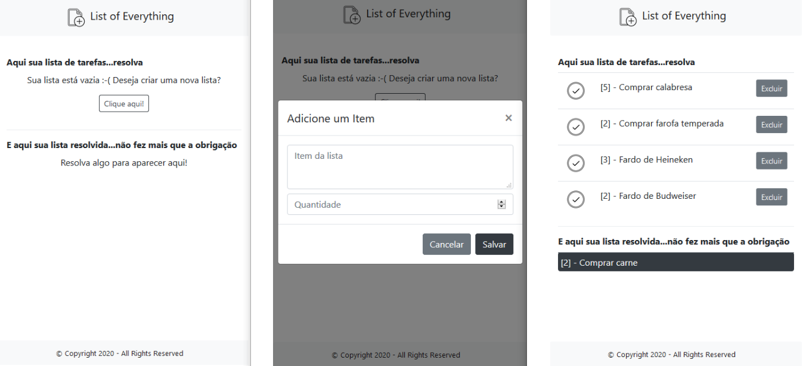

# List of Everything

Sistema de listagem de items temporários.

Desenvolvido utilizando node, com ejs como template engine e o framework web express.

1. Faça o **clone** do projeto
2. Agora basta apenas se dirigir a raiz do projeto e digitar **npm i**, assim irá realizar o download de todas as dependências
3. Ainda na raiz do projeto digite **node app**
4. O servidor será iniciado na porta **80**. Com isso basta digitar **_localhost_** na url de seu navegador

> Observação: todos os comandos acima devem ser digitados no interpretador de linha de comando (cmd/terminal) com o **_node_** instalado em sua máquina.

